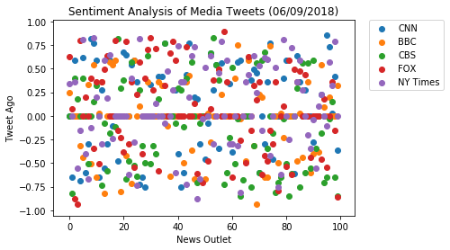
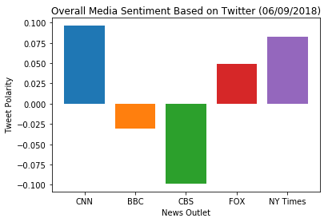

```python
import tweepy


from config import (consumer_key,
                    consumer_secret,
                    access_token,
                    access_token_secret)

auth = tweepy.OAuthHandler(consumer_key, consumer_secret)
auth.set_access_token(access_token, access_token_secret)
api = tweepy.API(auth, parser=tweepy.parsers.JSONParser())

from vaderSentiment.vaderSentiment import SentimentIntensityAnalyzer
analyzer = SentimentIntensityAnalyzer()

import pandas as pd
import matplotlib.pyplot as plt
import numpy as np


```


```python
cnn = "@CNN"
bbc = "@BBCWorld"
cbs = "@CBSNews"
fox = "@FoxNews"
nytimes = "@nytimes"
```


```python
compound_cnn = []
pos_cnn = []
neu_cnn = []
neg_cnn = []
cnn_text = []
source_cnn = []
tweets_ago = []
tweet_count = 0

for x in range(1, 6):
    public_tweets_cnn= api.user_timeline(cnn, page=x)

    for tweet in public_tweets_cnn:
        cnn_text.append(tweet["text"])
        source_cnn.append("CNN")
        
        tweets_ago.append(tweet_count)
        tweet_count = tweet_count + 1
        
        results = analyzer.polarity_scores(tweet["text"]) 
        
        compound_cnn.append(results["compound"])
        pos_cnn.append(results["pos"])
        neu_cnn.append(results["neu"])
        neg_cnn.append(results["neg"])
```


```python
df_cnn = pd.DataFrame(
    {'Source': source_cnn,
     'Compound Score': compound_cnn,
     'Text': cnn_text,
     'Positive Score': pos_cnn,
     'Neutral Score': neu_cnn,
     'Negative Score': neg_cnn,
     'Tweets Ago': tweets_ago
    })

df_cnn.head()
```


<div>
<style scoped>
    .dataframe tbody tr th:only-of-type {
        vertical-align: middle;
    }

    .dataframe tbody tr th {
        vertical-align: top;
    }

    .dataframe thead th {
        text-align: right;
    }
</style>
<table border="1" class="dataframe">
  <thead>
    <tr style="text-align: right;">
      <th></th>
      <th>Compound Score</th>
      <th>Negative Score</th>
      <th>Neutral Score</th>
      <th>Positive Score</th>
      <th>Source</th>
      <th>Text</th>
      <th>Tweets Ago</th>
    </tr>
  </thead>
  <tbody>
    <tr>
      <th>0</th>
      <td>0.0000</td>
      <td>0.000</td>
      <td>1.000</td>
      <td>0.000</td>
      <td>CNN</td>
      <td>RT @cnnbrk: After Trump reversed his position ...</td>
      <td>0</td>
    </tr>
    <tr>
      <th>1</th>
      <td>-0.6486</td>
      <td>0.218</td>
      <td>0.782</td>
      <td>0.000</td>
      <td>CNN</td>
      <td>News of Anthony Bourdain’s death shook people ...</td>
      <td>1</td>
    </tr>
    <tr>
      <th>2</th>
      <td>0.5859</td>
      <td>0.000</td>
      <td>0.847</td>
      <td>0.153</td>
      <td>CNN</td>
      <td>One step on the island of Bermuda, and it's im...</td>
      <td>2</td>
    </tr>
    <tr>
      <th>3</th>
      <td>0.0000</td>
      <td>0.000</td>
      <td>1.000</td>
      <td>0.000</td>
      <td>CNN</td>
      <td>As the millions of US children diagnosed with ...</td>
      <td>3</td>
    </tr>
    <tr>
      <th>4</th>
      <td>-0.6901</td>
      <td>0.262</td>
      <td>0.738</td>
      <td>0.000</td>
      <td>CNN</td>
      <td>President Trump calls Canadian Prime Minister ...</td>
      <td>4</td>
    </tr>
  </tbody>
</table>
</div>


```python
compound_bbc = []
pos_bbc = []
neu_bbc = []
neg_bbc = []
bbc_text = []
source_bbc = []
tweets_ago = []
tweet_count = 0


for x in range(1, 6):
    public_tweets_bbc= api.user_timeline(bbc, page=x)

    for tweet in public_tweets_bbc:
        bbc_text.append(tweet["text"])
        source_bbc.append("BBC")
        
        tweets_ago.append(tweet_count)
        tweet_count = tweet_count + 1
        
        results = analyzer.polarity_scores(tweet["text"]) 
        
        compound_bbc.append(results["compound"])
        pos_bbc.append(results["pos"])
        neu_bbc.append(results["neu"])
        neg_bbc.append(results["neg"])
```


```python
df_bbc = pd.DataFrame(
    {'Source': source_bbc,
     'Compound Score': compound_bbc,
     'Text': bbc_text,
     'Positive Score': pos_bbc,
     'Neutral Score': neu_bbc,
     'Negative Score': neg_bbc
    })

df_bbc.head()
```


<div>
<style scoped>
    .dataframe tbody tr th:only-of-type {
        vertical-align: middle;
    }

    .dataframe tbody tr th {
        vertical-align: top;
    }

    .dataframe thead th {
        text-align: right;
    }
</style>
<table border="1" class="dataframe">
  <thead>
    <tr style="text-align: right;">
      <th></th>
      <th>Compound Score</th>
      <th>Negative Score</th>
      <th>Neutral Score</th>
      <th>Positive Score</th>
      <th>Source</th>
      <th>Text</th>
    </tr>
  </thead>
  <tbody>
    <tr>
      <th>0</th>
      <td>0.2500</td>
      <td>0.000</td>
      <td>0.846</td>
      <td>0.154</td>
      <td>BBC</td>
      <td>Sabrina Simader: 'I realised my Winter OIympic...</td>
    </tr>
    <tr>
      <th>1</th>
      <td>0.0000</td>
      <td>0.000</td>
      <td>1.000</td>
      <td>0.000</td>
      <td>BBC</td>
      <td>Serial poopers: What makes people poo in publi...</td>
    </tr>
    <tr>
      <th>2</th>
      <td>0.0000</td>
      <td>0.000</td>
      <td>1.000</td>
      <td>0.000</td>
      <td>BBC</td>
      <td>Donating money to homeless people using your p...</td>
    </tr>
    <tr>
      <th>3</th>
      <td>0.0000</td>
      <td>0.000</td>
      <td>1.000</td>
      <td>0.000</td>
      <td>BBC</td>
      <td>The Belgian students revising with monks at a ...</td>
    </tr>
    <tr>
      <th>4</th>
      <td>-0.3182</td>
      <td>0.187</td>
      <td>0.813</td>
      <td>0.000</td>
      <td>BBC</td>
      <td>The other Balochistan: Six stories of life in ...</td>
    </tr>
  </tbody>
</table>
</div>


```python
compound_cbs = []
pos_cbs = []
neu_cbs = []
neg_cbs = []
cbs_text = []
source_cbs = []
tweets_ago = []
tweet_count = 0


for x in range(1, 6):
    public_tweets_cbs= api.user_timeline(cbs, page=x)

    for tweet in public_tweets_cbs:
        cbs_text.append(tweet["text"])
        source_cbs.append("CBS")
        
        tweets_ago.append(tweet_count)
        tweet_count = tweet_count + 1
        
        results = analyzer.polarity_scores(tweet["text"]) 
        
        compound_cbs.append(results["compound"])
        pos_cbs.append(results["pos"])
        neu_cbs.append(results["neu"])
        neg_cbs.append(results["neg"])
```


```python
df_cbs = pd.DataFrame(
    {'Source': source_cbs,
     'Compound Score': compound_cbs,
     'Text': cbs_text,
     'Positive Score': pos_cbs,
     'Neutral Score': neu_cbs,
     'Negative Score': neg_cbs
    })

df_cbs.head()
```


<div>
<style scoped>
    .dataframe tbody tr th:only-of-type {
        vertical-align: middle;
    }

    .dataframe tbody tr th {
        vertical-align: top;
    }

    .dataframe thead th {
        text-align: right;
    }
</style>
<table border="1" class="dataframe">
  <thead>
    <tr style="text-align: right;">
      <th></th>
      <th>Compound Score</th>
      <th>Negative Score</th>
      <th>Neutral Score</th>
      <th>Positive Score</th>
      <th>Source</th>
      <th>Text</th>
    </tr>
  </thead>
  <tbody>
    <tr>
      <th>0</th>
      <td>0.0000</td>
      <td>0.000</td>
      <td>1.000</td>
      <td>0.000</td>
      <td>CBS</td>
      <td>Best-selling vehicle ever making a comeback to...</td>
    </tr>
    <tr>
      <th>1</th>
      <td>-0.8225</td>
      <td>0.432</td>
      <td>0.568</td>
      <td>0.000</td>
      <td>CBS</td>
      <td>Racist, misogynistic messages show dark side o...</td>
    </tr>
    <tr>
      <th>2</th>
      <td>0.4019</td>
      <td>0.000</td>
      <td>0.876</td>
      <td>0.124</td>
      <td>CBS</td>
      <td>With production of the VW beetle coming to an ...</td>
    </tr>
    <tr>
      <th>3</th>
      <td>0.1779</td>
      <td>0.075</td>
      <td>0.809</td>
      <td>0.116</td>
      <td>CBS</td>
      <td>Russian President Vladimir Putin was caught de...</td>
    </tr>
    <tr>
      <th>4</th>
      <td>0.0000</td>
      <td>0.000</td>
      <td>1.000</td>
      <td>0.000</td>
      <td>CBS</td>
      <td>Trump departs for summit in Singapore, skippin...</td>
    </tr>
  </tbody>
</table>
</div>


```python
compound_fox = []
pos_fox = []
neu_fox = []
neg_fox = []
fox_text = []
source_fox = []
tweets_ago = []
tweet_count = 0


for x in range(1, 6):
    public_tweets_fox= api.user_timeline(fox, page=x)

    for tweet in public_tweets_fox:
        fox_text.append(tweet["text"])
        source_fox.append("FOX")
        
        tweets_ago.append(tweet_count)
        tweet_count = tweet_count + 1
        
        results = analyzer.polarity_scores(tweet["text"]) 
        
        compound_fox.append(results["compound"])
        pos_fox.append(results["pos"])
        neu_fox.append(results["neu"])
        neg_fox.append(results["neg"])
```


```python
df_fox = pd.DataFrame(
    {'Source': source_fox,
     'Compound Score': compound_fox,
     'Text': fox_text,
     'Positive Score': pos_fox,
     'Neutral Score': neu_fox,
     'Negative Score': neg_fox
    })

df_fox.head()
```


<div>
<style scoped>
    .dataframe tbody tr th:only-of-type {
        vertical-align: middle;
    }

    .dataframe tbody tr th {
        vertical-align: top;
    }

    .dataframe thead th {
        text-align: right;
    }
</style>
<table border="1" class="dataframe">
  <thead>
    <tr style="text-align: right;">
      <th></th>
      <th>Compound Score</th>
      <th>Negative Score</th>
      <th>Neutral Score</th>
      <th>Positive Score</th>
      <th>Source</th>
      <th>Text</th>
    </tr>
  </thead>
  <tbody>
    <tr>
      <th>0</th>
      <td>0.6249</td>
      <td>0.000</td>
      <td>0.823</td>
      <td>0.177</td>
      <td>FOX</td>
      <td>.@DarrellIssa: "[@POTUS] has a great deal of c...</td>
    </tr>
    <tr>
      <th>1</th>
      <td>0.0772</td>
      <td>0.000</td>
      <td>0.936</td>
      <td>0.064</td>
      <td>FOX</td>
      <td>.@DarrellIssa: "One of the challenges that oth...</td>
    </tr>
    <tr>
      <th>2</th>
      <td>-0.8807</td>
      <td>0.421</td>
      <td>0.579</td>
      <td>0.000</td>
      <td>FOX</td>
      <td>.@hogangidley45 on illegal immigrant crime sta...</td>
    </tr>
    <tr>
      <th>3</th>
      <td>-0.9305</td>
      <td>0.464</td>
      <td>0.536</td>
      <td>0.000</td>
      <td>FOX</td>
      <td>.@hogangidley45 on illegal immigrant crime sta...</td>
    </tr>
    <tr>
      <th>4</th>
      <td>0.7964</td>
      <td>0.000</td>
      <td>0.664</td>
      <td>0.336</td>
      <td>FOX</td>
      <td>.@hogangidley45 on @dennisrodman supporting @P...</td>
    </tr>
  </tbody>
</table>
</div>


```python
compound_nytimes = []
pos_nytimes = []
neu_nytimes = []
neg_nytimes = []
nytimes_text = []
source_nytimes = []
tweets_ago = []
tweet_count = 0


for x in range(1, 6):
    public_tweets_nytimes = api.user_timeline(nytimes, page=x)

    for tweet in public_tweets_nytimes:
        nytimes_text.append(tweet["text"])
        source_nytimes.append("NY Times")
        
        tweets_ago.append(tweet_count)
        tweet_count = tweet_count + 1
        
        results = analyzer.polarity_scores(tweet["text"]) 
        
        compound_nytimes.append(results["compound"])
        pos_nytimes.append(results["pos"])
        neu_nytimes.append(results["neu"])
        neg_nytimes.append(results["neg"])
```


```python
df_nytimes = pd.DataFrame(
    {'Source': source_nytimes,
     'Compound Score': compound_nytimes,
     'Text': nytimes_text,
     'Positive Score': pos_nytimes,
     'Neutral Score': neu_nytimes,
     'Negative Score': neg_nytimes
    })

df_nytimes.head()
```


<div>
<style scoped>
    .dataframe tbody tr th:only-of-type {
        vertical-align: middle;
    }

    .dataframe tbody tr th {
        vertical-align: top;
    }

    .dataframe thead th {
        text-align: right;
    }
</style>
<table border="1" class="dataframe">
  <thead>
    <tr style="text-align: right;">
      <th></th>
      <th>Compound Score</th>
      <th>Negative Score</th>
      <th>Neutral Score</th>
      <th>Positive Score</th>
      <th>Source</th>
      <th>Text</th>
    </tr>
  </thead>
  <tbody>
    <tr>
      <th>0</th>
      <td>0.3400</td>
      <td>0.000</td>
      <td>0.893</td>
      <td>0.107</td>
      <td>NY Times</td>
      <td>Trudeau sought to play down personal clashes w...</td>
    </tr>
    <tr>
      <th>1</th>
      <td>0.0000</td>
      <td>0.000</td>
      <td>1.000</td>
      <td>0.000</td>
      <td>NY Times</td>
      <td>Nick Cave Wants You to Work It Out on the Danc...</td>
    </tr>
    <tr>
      <th>2</th>
      <td>0.3612</td>
      <td>0.000</td>
      <td>0.906</td>
      <td>0.094</td>
      <td>NY Times</td>
      <td>Janelle Monáe brings a pair of big fuzzy socks...</td>
    </tr>
    <tr>
      <th>3</th>
      <td>-0.5574</td>
      <td>0.146</td>
      <td>0.854</td>
      <td>0.000</td>
      <td>NY Times</td>
      <td>RT @kimseverson: Here's a sketch of Bourdain’s...</td>
    </tr>
    <tr>
      <th>4</th>
      <td>-0.1531</td>
      <td>0.151</td>
      <td>0.849</td>
      <td>0.000</td>
      <td>NY Times</td>
      <td>Judge Stops Deportation of a New York Pizza De...</td>
    </tr>
  </tbody>
</table>
</div>


```python
df = pd.concat([df_cnn, df_bbc, df_cbs, df_fox, df_nytimes], ignore_index=True)
df.to_csv("twines_jsm.csv")
```


```python
df_grouped = df.groupby("Source")
df_grouped.mean()
```


<div>
<style scoped>
    .dataframe tbody tr th:only-of-type {
        vertical-align: middle;
    }

    .dataframe tbody tr th {
        vertical-align: top;
    }

    .dataframe thead th {
        text-align: right;
    }
</style>
<table border="1" class="dataframe">
  <thead>
    <tr style="text-align: right;">
      <th></th>
      <th>Compound Score</th>
      <th>Negative Score</th>
      <th>Neutral Score</th>
      <th>Positive Score</th>
      <th>Tweets Ago</th>
    </tr>
    <tr>
      <th>Source</th>
      <th></th>
      <th></th>
      <th></th>
      <th></th>
      <th></th>
    </tr>
  </thead>
  <tbody>
    <tr>
      <th>BBC</th>
      <td>-0.030140</td>
      <td>0.08987</td>
      <td>0.83823</td>
      <td>0.07190</td>
      <td>NaN</td>
    </tr>
    <tr>
      <th>CBS</th>
      <td>-0.098468</td>
      <td>0.12486</td>
      <td>0.80707</td>
      <td>0.06808</td>
      <td>NaN</td>
    </tr>
    <tr>
      <th>CNN</th>
      <td>0.096115</td>
      <td>0.05896</td>
      <td>0.85483</td>
      <td>0.08623</td>
      <td>49.5</td>
    </tr>
    <tr>
      <th>FOX</th>
      <td>0.048919</td>
      <td>0.08032</td>
      <td>0.82552</td>
      <td>0.09415</td>
      <td>NaN</td>
    </tr>
    <tr>
      <th>NY Times</th>
      <td>0.082367</td>
      <td>0.07253</td>
      <td>0.83043</td>
      <td>0.09703</td>
      <td>NaN</td>
    </tr>
  </tbody>
</table>
</div>


```python


x = range(0,len(tweets_ago))

          
plt.scatter(x, compound_cnn, label = "CNN")
plt.scatter(x, compound_bbc, label = "BBC")
plt.scatter(x, compound_cbs, label = "CBS")
plt.scatter(x, compound_fox, label = "FOX")
plt.scatter(x, compound_nytimes, label = "NY Times")

plt.title("Sentiment Analysis of Media Tweets (06/09/2018)")
plt.xlabel("News Outlet")
plt.ylabel("Tweet Ago")

plt.legend(bbox_to_anchor=(1.05, 1), loc=2, borderaxespad=0.)

```


    <matplotlib.legend.Legend at 0x1dc38855320>





```python
cnn = "@CNN"
bbc = "@BBCWorld"
cbs = "@CBSNews"
fox = "@FoxNews"
nytimes = "@nytimes"

plt.bar("CNN", np.mean(compound_cnn))
plt.bar("BBC", np.mean(compound_bbc))
plt.bar("CBS", np.mean(compound_cbs))
plt.bar("FOX", np.mean(compound_fox))
plt.bar("NY Times", np.mean(compound_nytimes))

plt.title("Overall Media Sentiment Based on Twitter (06/09/2018)")
plt.xlabel("News Outlet")
plt.ylabel("Tweet Polarity")

```


    Text(0,0.5,'Tweet Polarity')




